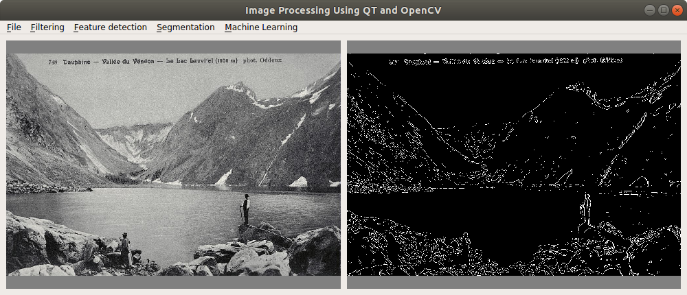

# Image Editor

A small image editor with different image processing algorithms implemented. The following dependencies are required to run the project: OpenCv, Qt



## Build & Run

Step by step commands in order to build and run the project:
```sh
$ mkdir build && cd build
$ cmake ..
$ make
```

To run the image editor:
```sh
$ ./main
```

You can also build and run the project using Qt Creator IDE
